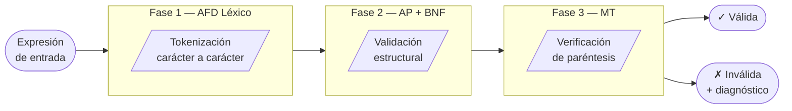
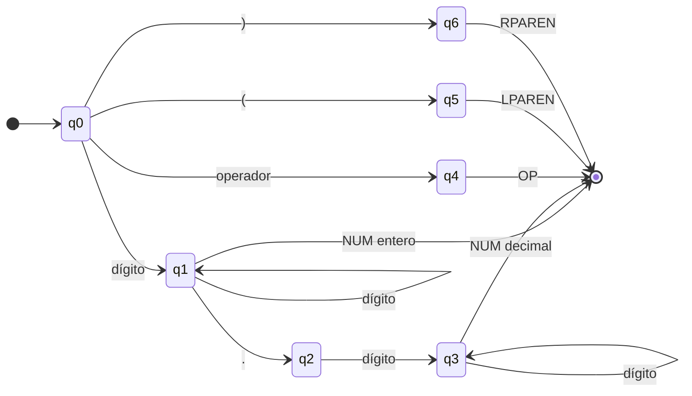
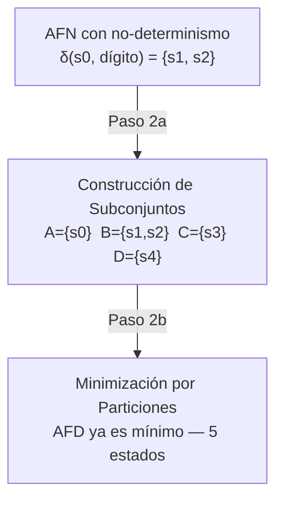
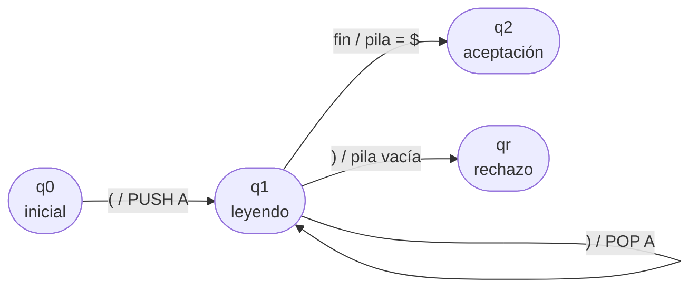
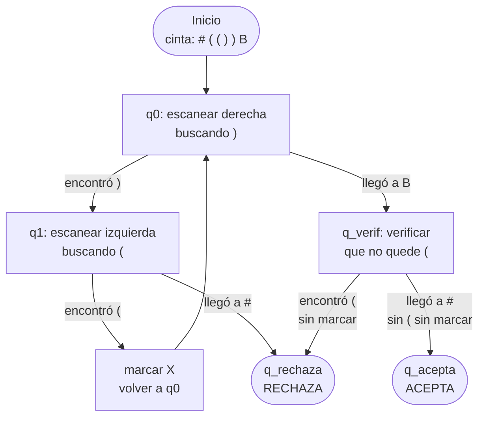

# Parser de Expresiones Matemáticas Educativas

**Trabajo Colaborativo Contextualizado — Teoría de Autómatas**  
Universidad de Cartagena · CTEV

---

Herramienta educativa que analiza expresiones matemáticas utilizando los cuatro modelos de autómatas vistos en el curso: AFD, AFN, Autómata de Pila y Máquina de Turing. El objetivo es ayudar a estudiantes a entender por qué una expresión es válida o inválida, mostrando el proceso interno paso a paso.

## Contexto

Los estudiantes de programación en Montería, Córdoba, cometen errores frecuentes al escribir expresiones matemáticas en entornos de programación: paréntesis sin cerrar, operadores mal ubicados, símbolos fuera del alfabeto. Este simulador actúa como un parser educativo que diagnostica esos errores con mensajes claros y los conecta con los conceptos formales de la teoría de autómatas.

---

## Arquitectura del sistema

El parser funciona como un pipeline de tres fases. Cada fase corresponde a un modelo de autómata diferente:



Si cualquier fase detecta un error, el proceso se detiene y se entrega un mensaje educativo con sugerencia de corrección.

---

## Componentes

### Paso 1 — Autómata Finito Determinista (AFD Léxico)

Recorre la expresión carácter a carácter y clasifica cada pieza en un tipo de *token*: `NUM`, `OP`, `LPAREN` o `RPAREN`. Implementa la estrategia de máxima mordida: consume el token más largo posible antes de emitirlo.



**Alfabeto reconocido:** dígitos `0–9`, punto `.`, operadores `+ - * /`, paréntesis `( )`.  
**Error léxico:** cualquier símbolo fuera de este conjunto (como `@`, `$`, letras) es rechazado inmediatamente.

---

### Paso 2 — AFN y equivalencia con el AFD

Se construye un AFN con no-determinismo explícito: desde el estado inicial `s0`, al leer un dígito se puede ir simultáneamente a `s1` (entero) y a `s2` (inicio de decimal). Luego se aplica:

1. **Construcción de subconjuntos** — convierte el AFN en un AFD equivalente agrupando conjuntos de estados.
2. **Minimización por particiones** — reduce el AFD al menor número de estados posible.



El resultado demuestra que el AFD es ya mínimo: ningún par de estados puede fusionarse porque todos tienen comportamientos distintos.

---

### Paso 3 — Gramática BNF y Autómata de Pila

La gramática formal del lenguaje está definida en notación BNF:

```
<expresion> ::= <termino>
              | <expresion> '+' <termino>
              | <expresion> '-' <termino>

<termino>   ::= <factor>
              | <termino> '*' <factor>
              | <termino> '/' <factor>

<factor>    ::= NUM
              | '(' <expresion> ')'
              | '-' <factor>
```

La jerarquía de reglas determina la **precedencia de operadores**: `*` y `/` están en una regla más interna que `+` y `-`, por lo que se evalúan primero. El menos unario tiene la mayor precedencia de todas.

El Autómata de Pila implementa estas reglas con una pila explícita. Al encontrar `(` apila el símbolo `A`; al encontrar `)` lo desapila. Al terminar, acepta únicamente si la pila queda con solo el símbolo de fondo `$`.



---

### Paso 4 — Máquina de Turing

La MT verifica el balance de paréntesis reescribiendo la cinta mediante el algoritmo de **marcado de pares de adentro hacia afuera**:



El marcador `#` en el extremo izquierdo de la cinta evita que el cabezal se desplace infinitamente a la izquierda — es una técnica estándar en diseño de MT.

---

## Estructura de archivos

```
TCC-Teorias-Automatas/
│
├── simulador.py               ← Punto de entrada principal
├── pruebas.py                 ← Suite de 30 casos de prueba
│
└── src/
    ├── __init__.py            ← Marca la carpeta como paquete Python
    ├── afd_lexico.py          ← Paso 1: AFD léxico
    ├── afn_equivalencias.py   ← Paso 2: AFN + conversión + minimización
    ├── ap_sintactico.py       ← Paso 3: AP + parser BNF
    ├── mt_verificador.py      ← Paso 4: Máquina de Turing
    └── parser.py              ← Paso 5: Pipeline integrado
```

---

## Cómo ejecutar

**Requisitos:** Python 3.8 o superior. No se requieren librerías externas.

```bash
# Clonar el repositorio
git clone <url-del-repositorio>
cd TCC-Teorias-Automatas

# Simulador interactivo (menú completo)
python3 simulador.py

# Suite de pruebas automáticas
python3 pruebas.py
```

### Opciones del simulador

| Opción | Descripción |
|--------|-------------|
| `1` | Analizar una expresión — muestra las tres fases con diagnóstico |
| `2` | Tabla de transiciones del AFD léxico |
| `3` | AFN, construcción de subconjuntos y minimización |
| `4` | Simulación paso a paso del Autómata de Pila |
| `5` | Simulación paso a paso de la Máquina de Turing |
| `6` | Suite de 20 pruebas automáticas |
| `7` | Gramática BNF con ejemplos de derivación |
| `8` | Guía de errores comunes y cómo corregirlos |

---

## Resultados de pruebas

La suite completa (`pruebas.py`) ejecuta 30 casos organizados en cinco categorías:

| Categoría | Casos | Resultado |
|-----------|-------|-----------|
| A — Expresiones válidas | 13 | 13/13 ✓ |
| B — Errores léxicos | 5 | 5/5 ✓ |
| C — Errores de operadores | 5 | 5/5 ✓ |
| D — Errores de paréntesis | 5 | 5/5 ✓ |
| E — Casos borde | 2 | 2/2 ✓ |
| **Total** | **30** | **30/30 — 100 %** |

Tiempo promedio de análisis por expresión: **0.04 ms**.

---

## Ejemplo de análisis

```
Expresión: (3 + 5) * 2

FASE 1 — Análisis Léxico (AFD)          [✓]
Tokens: LPAREN  NUM  OP  NUM  RPAREN  OP  NUM

FASE 2 — Análisis Sintáctico (AP + BNF) [✓]
Estructura BNF correcta.

FASE 3 — Verificación MT (Paréntesis)   [✓]
Paréntesis extraídos: '()'
Paréntesis balanceados — ACEPTADA.

RESULTADO: EXPRESIÓN VÁLIDA ✓
```

```
Expresión: (3 + 4

FASE 1 — Análisis Léxico (AFD)          [✓]
FASE 2 — Análisis Sintáctico (AP + BNF) [✗]
  Se esperaba ')' para cerrar paréntesis, pero se encontró 'fin de expresión'.
FASE 3 — Verificación MT (Paréntesis)   [✗]
  Paréntesis NO balanceados — RECHAZADA.

RESULTADO: EXPRESIÓN INVÁLIDA ✗
```

---

## Modelos implementados

El proyecto implementa los cuatro modelos de la jerarquía de Chomsky estudiados en el curso, aplicados todos al mismo problema concreto:

| Modelo | Poder expresivo | Uso en este proyecto |
|--------|----------------|----------------------|
| AFD | Lenguajes regulares | Tokenización léxica |
| AFN → AFD | Lenguajes regulares (equivalente) | Demostración de equivalencia |
| AP + BNF | Lenguajes libres de contexto | Validación sintáctica |
| MT | Lenguajes recursivamente enumerables | Verificación de paréntesis |
